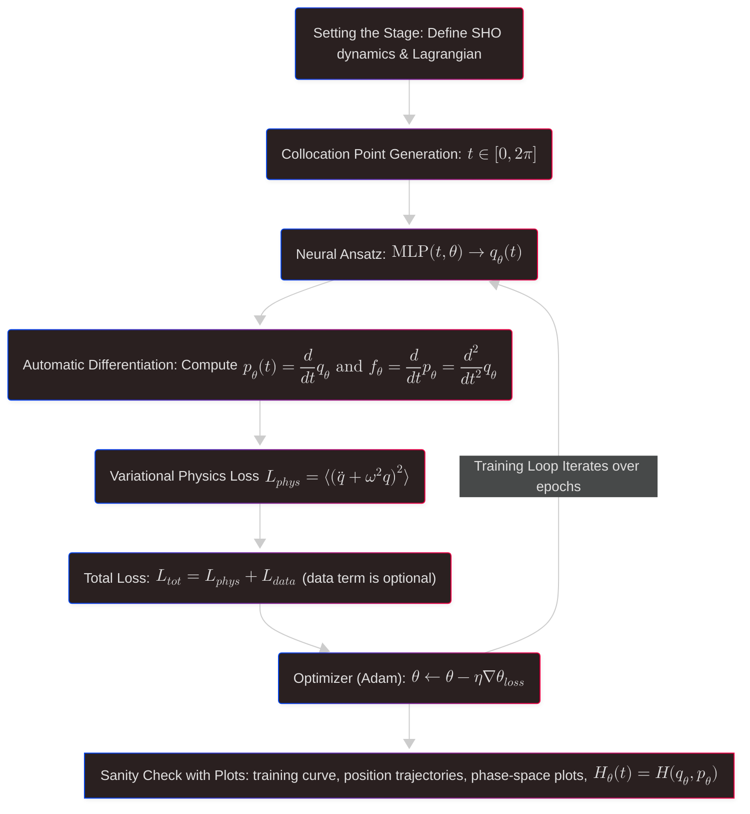

# lf-pinn-harmonic-oscillator
A **low-fidelity physics-informed neural network (PINN)** demonstrating how physics can guide learning via variational pricniples. 
This repository simulates a **1D simple harmonic oscillator (SHO)** with an unknown frequency while softly enforcing the equation of motion and energy conservation.
The purpose of this repo is to serve as a foundational teaching module in physics-informed machine learning (PIML), emphasizing **interpretability** and **parsimony** oveer accuracy or performance.


---

## 🗂️ Repo structure

```
lf-pinn-harmonic-oscillator/
├── README.md
├── requirements.txt
├── pyproject.toml
├── src/
│   ├── model.py          # neural network ansatz
│   ├── physics.py        # SHO + variational loss
│   ├── train.py          # training loop and CLI
│   └── utils.py          # helper functions (e.g., seeding)
├── notebooks/
│   └── demo.ipynb        # visual + narrative
└── artifacts/
    ├── training.png                # training curve
    ├── position_trajectory.png     # model output (position space)
    ├── energy.png                  # Hamiltonian evolution
    ├── phase_space.png             # phase space with learned Hamiltonian flow
    ├── phase_space_quiver.png      # phase space with learned Hamiltonian vector field
    ├── figures.md                  # figure analysis
    └── notes.md                    # conceptual notes and reflections
```



---

## 🔰 Implementation Overview
### Physical system: Simple Harmonic oscillator (SHO)

We model a non-dimensionalized 1-D SHO using the Lagrangian,

  $$ L(q,\dot{q}) = \frac{1}{2}\dot{q}^2 - \frac{1}{2}\omega^2 q^2 $$

where $q(t)$ denotes the trajectory of the oscillator's position about an equilibrium point. 
  
### Neural ansatz

  $$ q_\theta(t) = \text{MLP}(t, \theta) $$

### Variational loss (soft constraint $\Rightarrow$ low fidelity) 

Rather than solving exactly, the **Euler-Lagrange residual** is penalized at collation points in time.

  $$ \mathcal{L}_{phys} = \bigg< \bigg( \frac{d}{dt}\frac{\partial L}{\partial \dot{q}} - \frac{\partial L}{\partial q} \bigg)^2 \bigg> $$

Which can be simplified to:

  $$ \mathcal{L}_{phys} = \big<(\ddot{q} + \omega^2 q)^2 \big> $$

> This encourages the network to respect physical dynamics. Note that the physical dynamics we want the model to respect are not directly enforced - hence "low-fidelity".
---

## 5 Machine Learning Stages (Brunton-inspired) 
1. **Problem formulation ✔️**
    Can a neural function approximator recover physically meaningful motion via minimization of a **variational resiudal**, rather than fitting observed data?
   
3. **Data collection and curation ✖️**
    - Intentionally minimal: no observational trajectories.
    - Collocation points in time serve as synthetic "data" to embed physics into training.
    
4. **Neural architecture ⚠️**
    - Low-depth MLP, scalar input $\rightarrow$ scalar output, `tanh` activations.
    - No convolutions, recurrence, or unnecessary inductive biases.
    - Physics enters through the **loss function**, not the architecture.

6. **Loss function ✅**
    $$\mathcal{L}_{phys} = \Big< (\ddot{q} + \omega^2q)^2\Big>$$
    - Encodes Euler-Lagrange structure, second-order dynamics, and physical consistency.


8. **Optimization Strategy ❎⚠️**
    -  Standard Adam optimizer with fixed learning rate.
    -  Optimization is intented to **reveal physical structure**, rather than fully customize for performance. 
    -  Future work: explore trainable $\omega$, unique optimizers, and richer PINN designs.


---

## 🔰 Quick Start

```bash
# Install dependencies
pip install -e .

# Train a model with default settings
python -m train

# Launch demo notebook
jupyter lab notebooks/demo.ipynb
```

Optional CLI flags:
```bash
python -m train --hidden 128 --epochs 5000 --n-points 200 --omega 1.0 --seed 42 --device cpu
```
---

## 🏡 Take Home Messages


---

## Next Steps
- Train models with learnable frequency $\omega$.
- Condition the network explicitly on $\omega$.
- Explore richer low-fidelity physics constraints and Hamiltonian structure preservation (e.g., energy conservation loss term).
- Explore ways to introduce inductive biases (limitations).
---

## ⚠️ Limitations
1. **Point Density Matters** 
   - Spectral bias causes aliasing when $\omega$ or $T_\text{max}$ are increased too much (conceptually analogous to Nyquist sampling). 
       - Insufficient point density will be unable to resolve the curvature 'resolution' that is required by the governing differential equations.
         - 🏡 **Take-Home Messages:** Always scale `n_points` relative to `T_max`.
         - [ ] Are there any known methods of properly scaling n_points relative to T_max? Is this still low fidelity?
     - Neural networks naturally learn lower-frequency components first. High-frequency oscillators may require specialized architectures or adoptive sampling 
       - [ ] ❓What is adoptive sampling?).
   - 📝 **Note:** A low-resolution collocation density breaks conservation even if optimization converges.
     - [ ] Need Source

2. **Constraint Interference** 

    - Increasing $T_\text{max}$ increases non-convexity, introduces more competing constraints, and creates saddle points and poor basins.
    - This manifests as gradually increasing "spike-amplitudes" in the training curve and reflects the optimizer being repeatedly redirected by global physics constraints (see Figure 1 in `../artifacts/figures.md`).
    - Ultimately prevents the model converging too a stable basin.
      - [ ] Provide a source
      - [ ] What is a basin? What makes it poor vs. stable?
    
3. **Soft Constraints** 

   - Unlike symplectic integrators, this model does not strictly conserve the Hamiltonian, 
   - As the time window increases, the overall domain grows and the trivial solution $\begin{bmatrix} q_\theta \\ p_\theta \end{bmatrix} = \mathbf{0}$ increasingly dominates the loss landscape due to global satisfaction of physical constraints. 
   - This is expected in 'pure' physics-informed learning without data anchoring.
     - [ ] ⚠️ Would like to visualize this after i get the repo public-> increase scale on energy plot
     - [ ] Is this where the energy constraint that PyCharm suggested comes in?

4. **Resampling Trade-offs**
   - **Static Points:** Stable training, but the model might overfit constraint satisfaction at specific locations.
   - **Dynamic (Resampled) Points:** Better generalization across the whole domain,  but introduces variance (i.e., "noise") in the training curve.

5. **Extrapolation (00D)** 
   - As a global function approximator, the MLP acts as an interpolator. 
   - Consequently, performance degrades rapidly outside the training window $[0, 2\pi]$ unless periodic inductive biases are introduced.
     - [ ] Source?

---

## 📚 Citations
- **PINNs Foundational Paper:** Raissi, M., Perdikaris, P., & Karniadakis, G. E. (2019). Physics-informed neural networks: A deep learning framework for solving forward and inverse problems involving nonlinear partial differential equations. *Journal of Computational Physics*, 378, 686-707.
- **Data-Driven Modeling:** Brunton, S. L., & Kutz, J. N. (2022). *Data-Driven Science and Engineering: Machine Learning, Dynamical Systems, and Control*. Cambridge University Press.
- **Variational Mechanics:** Goldstein, H., Poole, C., & Safko, J. (2001). *Classical Mechanics*. Pearson.
- **PINNs Fauliure Modes:** Basir, S., & Senocak, I. (2022). Critical investigation of failure modes in physics-informed neural networks. AIAA SCITECH 2022 Forum. https://doi.org/10.2514/6.2022-2353

---

## Conceptual Notes
Refer to `artifacts/notes.md` for:
- **Symplectic forms:** $dq \wedge dp$ and Hamiltonian flow
- **Bilinear/skew-symmetric mappings**
- **Clifford algebra:** bivectors generating phase-space rotations
- Interpretation of low-fidelity PINNs: penalizing deviations from physical constraints, not exact enforcement


> *"The harmonic oscillator is to physics what linear regression is to machine learning."*

## Author
Lauren Shriver | Scriber Labs © 2025-2026
