# lf-pinn-harmonic-oscillator
A **low-fidelity physics-informed neural network (PINN)** demonstrating how physics can guide learning via variational principles. 
- Simulates a **1D simple harmonic oscillator (SHO)** with an unknown frequency while softly enforcing the equation of motion and analyzing 
energy conservation.
- Prioritizes geometric intuition and failure-mode visibility over benchmark performance.
- Motivated by the perspective taken by Kutz & Brunton (2022) that parsimony itself is a powerful regularizer in physics informed machine learning (PIML).

> 🥅 The purpose of this repo is to serve as a foundational teaching module in PIML design, emphasizing **interpretability** and **parsimony** over accuracy or performance.

---

## 🗂️ Repo structure

```
lf-pinn-harmonic-oscillator/
├── README.md
├── requirements.txt
├── pyproject.toml
├── assets/
│   ├── images/
│   ├── action_area.png   # tikz image depiction of the action as the area of inside energy flows
├── src/
│   ├── model.py          # neural network ansatz
│   ├── physics.py        # SHO + variational loss
│   ├── train.py          # training loop and CLI
│   └── utils.py          # helper functions (e.g., seeding)
├── notebooks/
│   └── demo.ipynb        # visual + narrative
└── artifacts/
    ├── notes.md                        # conceptual notes and reflection
    ├── figures.md                      # structure-based analysis of demo visuals
    └── demo_visuals/                          
        ├── training.png                # training curve
        ├── position_space.png          # model output (position space)
        ├── energy.png                  # Hamiltonian evolution
        ├── phase_space_flow.png        # phase space with learned Hamiltonian flow
        └── phase_space_quiver.png      # phase space with learned Hamiltonian vector field
    
    
    

```
## Model Design

```mermaid
%%====================================================================
%%  CURVED-CORNER MERMAID WITH SUBGRAPH HEADER
%%====================================================================
%%{ init: {
        "theme": "base",
        "themeVariables": {
            "background": "#0d1117",
            "lineColor": "#14b5ff",
            "textColor": "#ffffff",
            "fontFamily": "'Aclonica', sans-serif",
            "borderRadius": "16"       /* larger radius for more rounded corners */
        },
        "handDrawn": true
    } }%%
%%====================================================================

flowchart TB

    %%--------------------------------------------------------------
    %%  COLOR RAMP (pseudo-gradient)
    %%--------------------------------------------------------------
    classDef stage0 fill:#0b1c2d,stroke:#14b5ff,stroke-width:2px,color:#ffffff,rx:12,ry:12;
    classDef stage1 fill:#0f2a3d,stroke:#14b5ff,stroke-width:2px,color:#ffffff,rx:12,ry:12;
    classDef stage2 fill:#103b4f,stroke:#00f5db,stroke-width:2px,color:#ffffff,rx:12,ry:12;
    classDef stage3 fill:#124f55,stroke:#00f5db,stroke-width:2px,color:#ffffff,rx:12,ry:12;
    classDef stage4 fill:#1a6b63,stroke:#00f5db,stroke-width:2px,color:#ffffff,rx:12,ry:12;
    classDef stage5 fill:#1f4e5f,stroke:#f78166,stroke-width:2px,color:#ffffff,rx:12,ry:12;
    classDef stage6 fill:#3a2f2a,stroke:#f78166,stroke-width:2px,color:#ffffff,rx:12,ry:12;
    classDef stage7 fill:#0f2a3d,stroke:#14b5ff,stroke-width:2px,color:#ffffff,rx:12,ry:12;

    classDef dashed fill:#161b22,stroke:#14b5ff,stroke-dasharray:6 6,color:#ffffff,rx:12,ry:12;

    %%--------------------------------------------------------------
    %%  MAIN PIPELINE SUBGRAPH WITH HEADER
    %%--------------------------------------------------------------
    subgraph PIML["PIML Framework"]
        direction TB
        B["1️⃣ Collocation Points"]:::stage1
        C["2️⃣ Neural Ansatz"]:::stage2
        D["3️⃣ Automatic Differentiation"]:::stage3
        E["4️⃣ Variational Physics Loss"]:::stage4
        F["5️⃣ Total Loss"]:::stage5
        G["6️⃣ Optimizer (Adam)"]:::stage6

        B --> C
        C --> D
        D --> E
        E --> F
        F --> G
        G -- training loop --> C
    end

    %%--------------------------------------------------------------
    %%  CONTEXT & DIAGNOSTICS
    %%--------------------------------------------------------------
    A["0️⃣ Define SHO Dynamics"]:::stage0
    H["7️⃣ Diagnostics & Sanity Checks"]:::stage7

    A --> PIML:::dashed
    PIML --> H
    
    click C "assets/phase_space.png" "View figure"
```


### Pipeline Legend (Mathematical Mapping)

| Step | Component | Mathematical Description                                 | Interpretation                           |
|----|----|----------------------------------------------------------|------------------------------------------|
| 0️⃣ | Problem setup | SHO Lagrangian and equations of motion                   | Define the physical system               |
| 1️⃣ | Collocation points | $t \in [0, 2\pi]$                                        | Synthetic “data” for physics enforcement |
| 2️⃣ | Neural ansatz | $q_\theta(t) = \mathrm{MLP}(t,\theta)$                   | Learn a trajectory representation        |
| 3️⃣ | Automatic differentiation | $p_\theta = \dot q_\theta,\;\ddot q_\theta$              | Recover velocity and acceleration        |
| 4️⃣ | Physics loss | $\mathcal{L}_{phys}=\langle(\ddot q + \omega^2 q)^2\rangle$ | Encode Euler–Lagrange structure          |
| 5️⃣ | Total loss | $\mathcal{L}_{tot}=\mathcal{L}_{phys}$          | Low-fidelity PINN objective              |
| 6️⃣ | Optimization | $\theta \leftarrow \theta - \eta\nabla_\theta \mathcal{L}$ | Gradient-based learning                  |
| 7️⃣ | Diagnostics | $H_\theta(t)=H(q_\theta,p_\theta)$                       | Sanity checks & structure validation     |


---

## 🔰 Implementation Overview
### Physical system: Simple Harmonic oscillator (SHO)

We model a non-dimensionalized 1-D SHO using the Lagrangian,

  $$ L(q,\dot{q}) = \frac{1}{2}\dot{q}^2 - \frac{1}{2}\omega^2 q^2 $$

where $q(t)$ denotes the trajectory of the oscillator's position about an equilibrium point. 
  
### Neural ansatz: $q_\theta(t) = \text{MLP}(t, \theta)$

<p align="center">
  
</p>

<p align="center">
  <em>Multilayer perceptron architecture with two hidden layers of width 64.</em>
</p>

> **Architecture:**  
> $$\text{Linear} \rightarrow \tanh \rightarrow \text{Linear} \rightarrow \tanh \rightarrow \text{Linear}$$

- The  multilayer perceptron (MLP) maps time $t$ to a scalar output $q_\theta(t)$ represented the predicted trajectory of the SHO in 1D space.

- Each linear layer performs an affine change of coordinates, while the interwoven $\tanh$ activations introduce smooth nonlinear distortions.

- The composition of these layers allows the network to approximate curved dynamical trajectories while remaining differentiable, enabling physics-informed (soft) constraints
to bias the learned dynamics toward Hamiltonian structure.

### Variational loss (soft constraint $\Rightarrow$ low fidelity) 

Rather than solving the equations of motion exactly, the **Euler-Lagrange residual** is penalized at collation points in time.

  $$ \mathcal{L}_{phys} = \bigg< \bigg( \frac{d}{dt}\frac{\partial L}{\partial \dot{q}} - \frac{\partial L}{\partial q} \bigg)^2 \bigg> $$

Which can be simplified to:

  $$ \mathcal{L}_{phys} = \big<(\ddot{q} + \omega^2 q)^2 \big> $$

> This encourages the network to respect physical dynamics. Note that the physical dynamics we want the model to respect are not directly enforced - hence "low-fidelity".
---

## Five Machine Learning Stages (Brunton-inspired) 
### A. Problem formulation ✔️
    
   > **Research Question:** Can a neural function approximator recover physically meaningful motion via minimization of a **variational residual**, rather than fitting observed data?
   
### B. Data collection and curation ✖️
- Intentionally minimal (i.e., no observational trajectories).
- Collocation points in time serve as synthetic "data" to embed physics into training.
    
### C. Neural architecture ⚠️
- Low-depth MLP, scalar input $\rightarrow$ scalar output, `tanh` activations.
- No convolutions, recurrence, or unnecessary inductive biases.
- Physics enters through the **loss function**, not the architecture.

### D. Loss function ✅

$$\mathcal{L}_{phys} = \Big< (\ddot{q} + \omega^2q)^2\Big>$$
Encodes Euler-Lagrange structure, second-order dynamics, and physical consistency.

### E. Optimization Strategy ❎⚠️
-  Standard Adam optimizer with fixed learning rate.
-  Optimization is intended to **reveal physical structure**, rather than fully customize for performance.

---

## 🔰 Quick Start

```bash
# Install dependencies
pip install -e .

# Train a model with default settings
python -m train

# Launch demo notebook
jupyter lab notebooks/demo.ipynb
```

Optional CLI flags:
```bash
python -m train --hidden 128 --epochs 5000 --n-points 200 --omega 1.0 --seed 42 --device cpu
```

---

## ⚠️ Limitations & Observable Failure Modes
This section documents both  theoretical limitations *and* the concrete failure modes that appear during training and evaluation. These behaviors are expected and are intentionally exposed to support interpretablity.
### 1. Spectral bias and Collocation Resolution
Increasing $\omega$ or $T_\text{max}$ too much causes aliasing (conceptually analogous to Nyquist sampling). This behavior is consistent with reported PINN failure modes under undersampling (Basir & Senocak, 2022).
  - Insufficient point density will be unable to resolve the curvature 'resolution' that is required by the governing differential equations.
  - Neural networks naturally learn lower-frequency components first. High-frequency oscillators may require specialized architectures or adaptive sampling.

📝 **Note:** A low-resolution collocation density breaks conservation even if optimization converges.
> 🏡 In practice, collocation density should scale with both the simulation window and the highest frequency content expected in the solution.

### 2. **Constraint Interference**
Increasing $T_\text{max}$ increases non-convexity, introduces more competing constraints, and creates saddle points and narrow/unstable basins of attraction.
- This manifests as gradually increasing "spike-amplitudes" in the training curve and reflects the optimizer being repeatedly redirected by global physics constraints (see Figure 1 in `../artifacts/figures.md`).
- Ultimately prevents the model converging to a stable basin.
    
### 3. **Soft Constraints** 
Unlike symplectic integrators, this model does not strictly conserve the Hamiltonian, 
   - As the time window increases, the overall domain grows and the trivial solution $\begin{bmatrix} q_\theta \\ p_\theta \end{bmatrix} = \mathbf{0}$ increasingly dominates the loss landscape due to global satisfaction of physical constraints. 
   - This is expected in 'pure' physics-informed learning without data anchoring.

### 4. **Resampling Trade-offs**
   - **Static Points:** Stable training, but the model might overfit constraint satisfaction at specific locations.
   - **Dynamic (Resampled) Points:** Better generalization across the whole domain,  but introduces variance (i.e., "noise") in the training curve.

### 5. **Extrapolation (OOD)** 
   - As a global function approximator trained on a bounded domain, the MLP primarily interpolates within the training domain (Brunton & Kutz, 2022). 
   - Consequently, performance degrades rapidly outside the training window $[0, 2\pi]$ unless periodic inductive biases are introduced.

---

## Next Steps
- Explore ways to implement adaptive sampling.
- Train models with learnable frequency $\omega$.
- Condition the network explicitly on $\omega$.
- Explore richer low-fidelity physics constraints and Hamiltonian structure preservation (e.g., energy conservation loss term).
- Explore ways to introduce inductive biases (limitations).

---

## 📚 Sources
## Citations
- Basir, S., & Senocak, I. (2022). *Critical investigation of failure modes in PINNs*. AIAA SCITECH. [@basir2022pinnfailures]
- Brunton, S. L., & Kutz, J. N. (2022). *Data-Driven Science and Engineering*. Cambridge University Press. [@brunton2022datadriven]
- Goldstein, H., Poole, C., & Safko, J. (2001). *Classical Mechanics*. Pearson. [@goldstein2001classical]
- Raissi, M., Perdikaris, P., & Karniadakis, G. E. (2019). *Physics-informed neural networks*. Journal of Computational Physics. [@raissi2019pinns]

---

## Conceptual Notes
Refer to `artifacts/notes.md` for:
- **Symplectic forms:** $dq \wedge dp$ and Hamiltonian flow
- **Bilinear/skew-symmetric mappings**
- **Clifford algebra:** bivectors generating phase-space rotations
- Interpretation of low-fidelity PINNs: penalizing deviations from physical constraints, not exact enforcement


> *"The harmonic oscillator is to physics what linear regression is to machine learning."*

## Author
Lauren Shriver | Scriber Labs © 2025-2026
