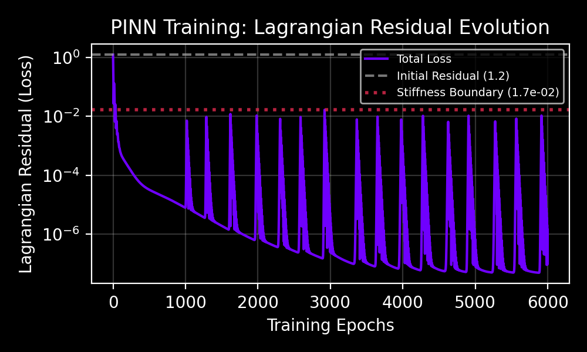
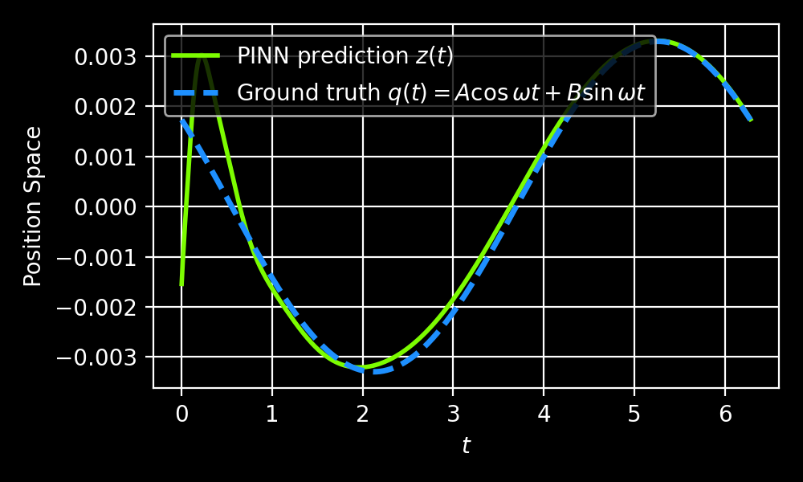
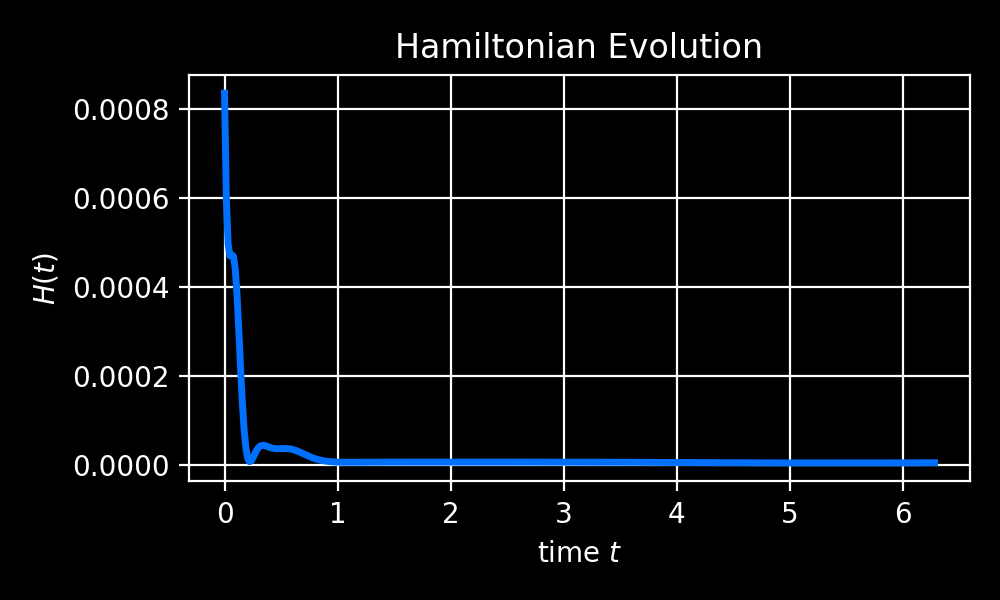
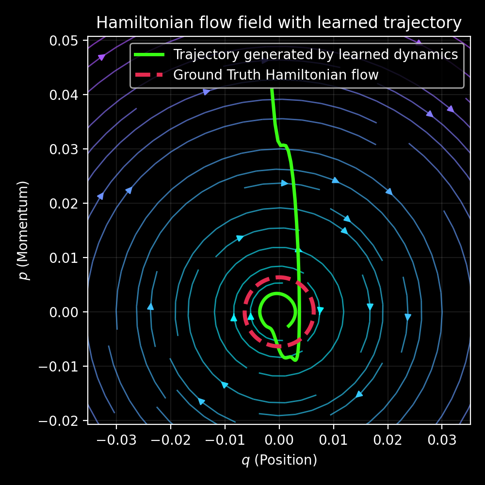

# Figure Analysis

## Figure 1 - Training Curve

Figure summary here.

---

## Figure 2 - Trajectories (Predicted and Ground Truth)

Figure summary here.

---
## Figure 3 - Hamiltonian Evolution

Figure summary here

---
## Figure 4 - Phase Space Trajectory Plotted over Hamiltonian Flow Fields 

> The PINN learns a single phase-space trajectory consistent with the Hamiltonian equations of motion. The analytic flow field (blue streamlines)  and contant-energy orbit (purple dotted)are shown for reference and are not learned by the model.
 
**Analytic flow fields** $$\dot{x}=p, \quad \dot{p}=-\omega^2 x $$

**Constant-energy orbit** $$H(x,p)=\text{const}$$

**PINN-Trajectory** $\rightarrow$ learned dynamics.

- [ ] Do my best to understand this:
  - The trajectory visually encodes:
    - Bivector-generated rotation
    - Sympletctic intuition
    - Hamiltonian flow wihtout formal machiner✔️