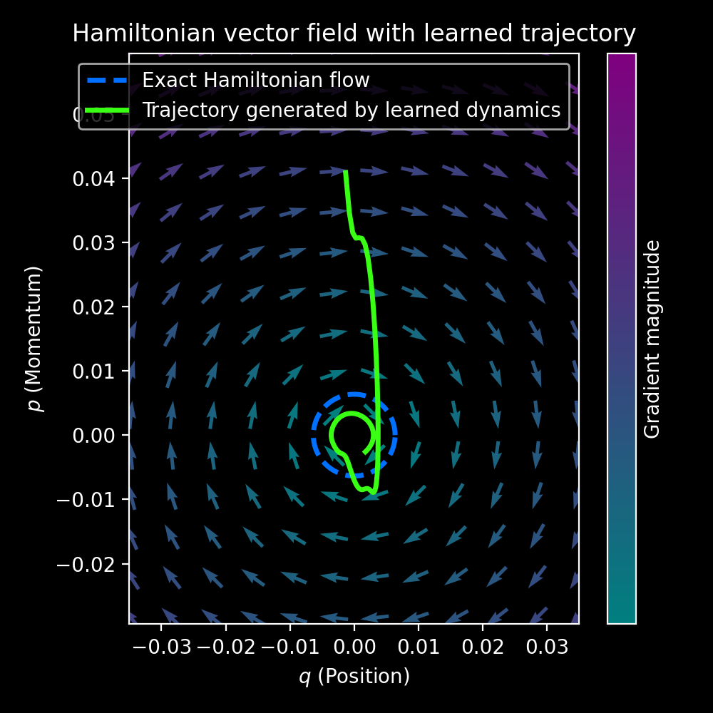

# Figure Analysis

## Figure 1 - Training Curve

> Training curve exhibits rapid initial descent followed by periodic spikes. 

The early descent reflects the network's ability to quickly
learn qualitative features rather than exact parameterization. This is followed with alternating regions
of rapid decent and constraint violations. 

Spikes reflect transient conflicts between trajectory fitting and antisymmetric
structure in the learned generator. This corresponds with the network "re-learning" the Interestingly, the peak height of the spikes is approximately constant.
---

## Figure 2 - Position Trajectory

> Position component of the predicted trajectory $q_\theta(t)$ (green curve)
> and the ground truth trajectory $q(t)$ (red dashed curve). 

Note that we use canonical coordinates $q(t)=x(t)$ and $p(t)=\dot{x}$, corresponding to the phase space of a one-dimensional harmonic oscillator. Parameters are normalized so that the mass and spring constant are implicitly absorbed into the natural frequency $\omega$. 

---
## Figure 3 - Hamiltonian Evolution

> The plot tracks the **Hamiltonian** evaluated along the predicted trajectory:
> $$H_\theta(t) = H\Big(q_\theta(t),p_\theta(t)\Big) = \frac{1}{2}p_\theta^2(t) + \frac{1}{2}\omega^2 q_\theta^2(t)$$

Note: The learned dynamics produce a vector field increasingly tangent to the contours of $H$. From this emerges conservation enforced by the learned structure rather than just numeric accuracy.

Three regions:
1. Sharp initial drop: Model discovers approximate invariant.
2. Small 'bump': Rebalancing between trajectory and structure losses.
3. Approximately flat region: Near-stationary energy error.
---
## Figure 4 - Phase Space Trajectory: Flow vs. Vectors
| Hamiltonian Streamlines | Hamiltonian Vector Field |
|:---:|:---:|
|  |  |

> **Left:** The analytic flow (blue streamlines) shows the global topology of the conservation law. **Right:** The vector field (quiver plot) shows the local direction and magnitude of the **symplectic flow** generated by the Hamiltonian.

**Analytic flow fields** (Hamilton's Equations): $$\dot{q}=p, \quad \dot{p}=-\omega^2 q $$

**PINN-Trajectory** $\rightarrow$ learned dynamics.
- **Variable Convention:** In dynamical systems and PINNs, the predicted state is typically denoted as $\mathbf{z}_\theta(t) = [q_\theta(t), p_\theta(t)]^T$. Using $\mathbf{z}_\theta$ (bold for vector) is considered best practice.
