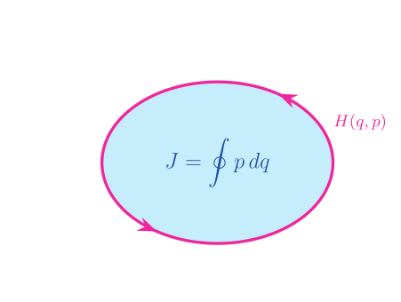

# LF PINN Harmonic Oscillator Notes - Geometry Notes
> **Scriber Labs -**  Intuition-first notes connecting Hamiltonian mechanics, symplectic geometry, and low-fidelity PINNs. 

## Scope and Goals
These notes collect the geometric ideas that motivate the **low-fidelity PINN (LF-PINN)** for the 1D simple harmonic oscillator (SHO). 
The emphasis is on *structure* (symplectic area, bivectors, and generators of flow), not on building an exact symplectic integrator.
---

## Bilinear skew-symmetric map
A function $\omega : V\times V \rightarrow \mathbb{R}$ is **skew-symmetric** if it is linear in
    $$ \forall u,v \in V, \quad \omega(u,v)=-\omega(v,u)$$

and  **bilinear** if it is linear in *each* argument.

> 🏡 **Take-Home Message:** Skew symmetry alone does not imply a function is bilinear. 

## Non-degeneracy
Let $V$ be a vector space over the real numbers, and let $\omega: V\times V \rightarrow \mathbb{R}$ be a bilinear function. 
The function $\omega$ is said to be **non-degenerate** iff
        
$$ \{ v \in V | \forall w\in V, \quad \omega(v,w) =0\} = \{ 0 \}.$$

Equivalently, $\omega$ is a non-degenerate function if and only if the zero vector is the only vector that pairs to zero along with every other vector in $v\in V$.

> 💎 **Gem Take-away:** Non-degeneracy induces an isomorphism $V \leftrightarrow V^*$.

---

## Symplectic form
- Casual Definition: A **symplectic form** measures *signed area* in phase space $(\bf{q}, \bf{p})$ 
- Technical definition: A **symplectic form** is a smooth, closed, non-degenerate, 2-form that fixes the orientation and geometry of phase space. 

For a 1D system in phase-space $(q,p)$, the corresponding symplectic form is $$\omega = dq \wedge dp$$

Properties:
1. **Closed:** $d\omega = 0$ 
2. **Non-degenerate**
3. **Smooth** differential form 
   - **Concept check:** Is this the same thing as 'well-behaved' functions in intro quantum mechanics courses?
     - Answer: No, smooth differential $\ne$ well-behaved (square-integrable, continuous)
4. **Antisymmetric**: $dq\wedge dp = -dp \wedge dq$

> 🏡 The antisymmetry property of phase space in physics is the root of:
 >  - Poisson brackets
 >  - Hamilton's equations
 >  - Conservation of phase-space volume

## Action as Phase-Space Area
<figure>
  
  <figcaption><em>Figure 1:</em> An arbitrary space energy contour of the harmonic oscillator. </figcaption>
</figure>

By Stokes' theorem, action $J=\oint{pdq}$ is precisely the signed area enclosed in $(q,p)$ space.

## Symplectic Forms and Harmonic Oscillator PINNs

For the 1D harmonic oscillator PINN, the symplectic form $\omega = dq \wedge dp$ induces Hamilton's equations:
$\dot{q}= \frac{\partial H}{\partial p}, \quad \dot{p}=-\frac{\partial H}{\partial q}$

where 

$$H(q,p) = \frac{p^2}{2m} + \frac{1}{2}k q^2 $$

is the Hamiltonian for the 1D harmonic oscillator. 

> ✨ This is the actual constraint our PINN is encouraged to respect. 

## Low-Fidelity: What it means for the purposes of this repo and Scriber Labs.
For this repository, **low fidelity** means
- Physical structure is *encouraged* via a soft penalty term in the loss
- Constraints are not directly enforced
- The goal is *interpretability*, not a guaranteed symplectic integrator

> 🏡 Thus, the overall model is biased toward a Hamiltonian structure without being strictly symplectic. 

### 🔵 Examples of valid LF constraints:
- Penalizing the residuals...
    $$ \begin{align*} \partial_tq - \frac{\partial H}{\partial p}, \quad \partial_tp + \frac{\partial H}{\partial q} \end{align*} $$

- Penalizing phase-space volume drift.

---

## Clifford Algebra Detour
In Clifford algebra $\omega = \partial_q \wedge \partial_p$ is just a bivector:
$$\partial_q \wedge \partial_p = \frac{1}{2}(\partial_q\partial_p - \partial_p \partial_q)$$

💎 Interpretation:
- $\omega$ generates rotations in phase space 
- Hamiltonian flow is a **bivector-generated motion**. 

### Bivector Operator as a Symplectic Matrix
The matrix 
    $J = \begin{pmatrix} 0 & 1 \\ -1 & 0 \end{pmatrix}$ 
is the matrix representation of $dq\wedge dp$.

In Clifford algebra language:
- $J$ corresponds to multiplication by the phase-space pseudoscalar
- Poisson brackets are bivector contractions.
- Hamilton's equations are rotations generated by the bivector $\omega$

> 🔑 In differential geometry, $\omega = dq \wedge dp$ is a 2-form. In Clifford algebra, its dual object is a bivector generating rotations.

---

## Next Steps: Write First Zettelkasten 'Zettels'
- [ ] Vectors vs. covectors (and why momenta live naturally as covectors)
- [ ] Covectors in geometric/ Clifford algebra
- [ ] Hamiltonian mechanics from geometry (kinetic + potential $\rightarrow$ flow)
- [ ] Laplacian from Hamiltonian structure
- [ ] Duals of covectors (contrast with cross vs. wedge products)
- [ ] Convince myself that 
  $J = \begin{pmatrix} 0 & 1 \\ -1 & 0 \end{pmatrix}$ is the matrix representation of $dq\wedge dp$.
- [ ] **Concept check:** Is the phase-space pseudoscalar $I=dq\wedge dp$ a *differential-sized* version of $\mathbb{e}_1 \wedge \mathbb{e}_2$?
- [ ] Bivector contractions and Poisson brackets.

## 📝 Final Remarks
- The action (units of angular momentum) is not just a phase-space volume, it is an *oriented* phase space volume.
- For symplectic systems, the 'action' is signed areas enclosed by 'Hamiltonian flows'
- Hamiltonian dynamics = bivector-generated motion.
- The action $S$ is the area inside energy flows in phase space.

---

# Citations
- Arnold, *Mathematical Methods of Classical Mechanics* [@arnold1989]
- Marsden & Ratiu, *Introduction to Mechanics and Symmetry* [@marsden1999]
